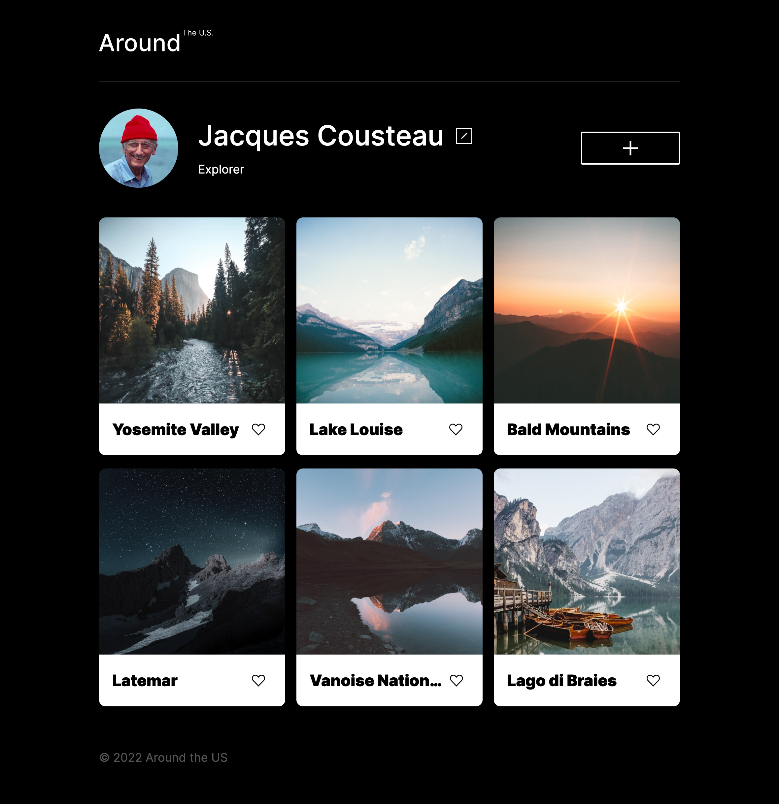

# Project 3: Around The U.S.

### Overview

- [Project Intro](#intro)
- Project Link
- Technologies Used
- Future Plans

**Project Intro**

Hi my name is Kevin Wessa and I am a student at Practicum.

This project is called **Around the U.S.**, and the focus in the current sprint is:

1. Follow a design using only a Figma file instead of a detailed brief and...
2. Ensure the design remains consistent at all breakpoints utilizing media queries.

**Project Link**
To access the project hosted by GitHub pages, click https://kjwessa.github.io/se_project_aroundtheus/

**Technologies Used**

- HTML5
- CSS3

**Technologies Used**
Outside of the project requirements in future sprints, I want to...

- Add additional breakpoints (user experience)
- Switch away from PX to REM (accessibility)
- Make the logo a link if project extends multiple pages (user experience)
- Create a loading animation if the app allows more than six pictures (user experience)
- Add tooltips or a first time tutorial for users (user experience)
- Allow the dimensions of the images to not be set to PX, and dynamically resize (design)
- Add outbound links in the footer (marketing)
- Add social links in the header (marketing)
- Update footer date dynamically in the footer using JS (legal)
